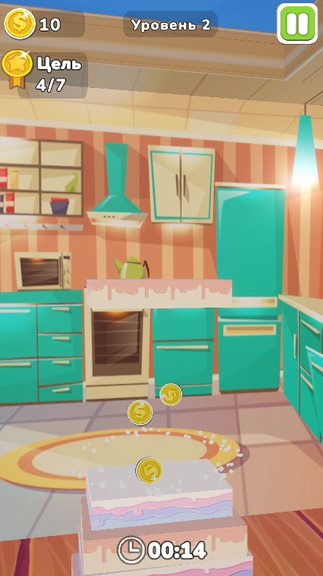
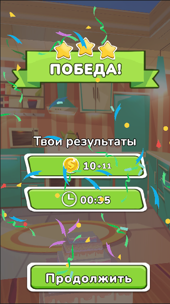

# Cake Tower 3D 

Жанры: Arcade, Casual, Tower Building

**Скачать:** [Cake Tower 3D](https://disk.yandex.ru/d/gnrCYrMEjpGUSw)

  

## Описание:
Авторская игра, в которой игрок строит башню из блоков-тортов.
Каждый блок последовательно изменяет размер: увеличивается-уменьшается,
в момент клика по экрану блок фиксирует свой размер и падает на башню.
Падающий блок взаимодействует с другими блоками башни, уничтожая блоки меньшего размера.
Цель игры - за ограниченное количество времени построить башню заданной высоты.
Поражение наступает при падении блоков башни или при истечении таймера.

  
  

## Ключевые особенности:
- Механика изменения размера блоков с фиксацией по клику
- Уничтожение блоков меньшего размера при падении нового блока
- Реализация башни на основе стека
- Использование событий для игровых реакций
- Управление игровым циклом через Finite State Machine

## Использованные технологии и подходы:
- Component-based архитектура (логика в компонентах)
- Event-driven взаимодействие между игровыми системами
- Finite State Machine для управления игровым циклом (меню, игра, победа, поражение)
- Использование Manager-компонентов для координации подсистем (аудио, VFX, игровая логика)
- Object Pooling для блоков башни и эффектов (уменьшение количества Instantiate/Destroy)
- ScriptableObjects для хранения данных (уровни, прогресс игрока, настройки sfx)
- Сохранение и загрузка данных (PlayerPrefs)
- Адаптивный UI (Safe Area, поддержка разных экранов вертикальной ориентации)
- Работа с VFX, Particle System и скриптовыми анимациями
- Работа с музыкой и звуковыми эффектами
- Работа с текстурами и визуальным оформлением игровых объектов

## Возможные улучшения реализации:
- Улучшить настройки сцены (изменить фон, пол, позицию башни)
- Разделить ответственность TowerManager на более мелкие (управление структурой башни, 
логика "съедания" блоков)
- Уменьшить связанность между компонентами (убрать прямые зависимости напр. TowerManager и LandingDetector, убрать синглтон)
- Повысить переиспользуемость отдельных компонентов
- Реализовать адаптивный интерфейс под горизонтальную ориентацию
- Стандартизировать стиль наименований и структуру проекта
- Добавить сохранение и загрузку параметров настроек
- Почистить проект от неиспользуемых ассетов
